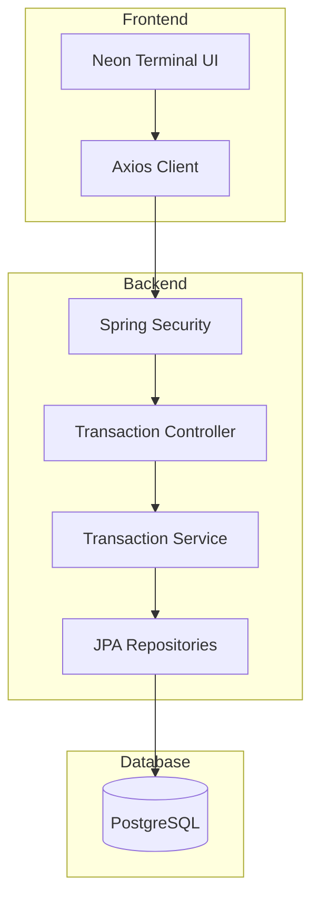

# ⚡ NEON LEDGER | District 01 Core Banking

A professional-grade full-stack banking application built with a focus on financial precision, secure transaction protocols, and a modern cyberpunk-styled terminal interface.

---

## 🏗️ System Architecture



## 🧠 Engineering Decisions (ADR)

### Atomic Transactions
Implemented `@Transactional` in the Service layer to ensure ACID properties and prevent partial transaction states.

### Financial Precision
Used `BigDecimal` instead of `Double` or `Float` to eliminate floating-point rounding errors in financial calculations.

### Security
Integrated Spring Security with Basic Authentication to protect API endpoints.

### API Documentation
Documented endpoints using OpenAPI / Swagger UI for clear API exploration and testing.

---

## 🚀 Key Technical Implementations

- ✅ CI/CD Pipeline – Automated testing suite triggered via GitHub Actions
- ✅ Production Deployment – Hosted on Railway using Java 21
- ✅ Global Exception Handling – Centralized error handling via `@ControllerAdvice`
- ✅ Docker Support – Containerized backend service
- ✅ Unit & Integration Testing – JUnit 5 + Mockito

---

## 🛠️ Tech Stack

### Backend
- Java 21
- Spring Boot 3
- Spring Security
- Spring Data JPA
- PostgreSQL
- Maven

### Frontend
- React
- Axios
- Node.js 18+

### DevOps
- GitHub Actions
- Docker
- Railway Deployment

---

## 🚦 Getting Started

### 📋 Prerequisites

- Java 21
- Node.js (v18+)
- PostgreSQL

---

## 💻 Backend Execution

```bash
cd core-banking/core-banking
./mvnw spring-boot:run
```

Backend will start on:

```
http://localhost:8080
```

Swagger UI:

```
http://localhost:8080/swagger-ui.html
```

---

## 🌐 Frontend Execution

```bash
cd banking-frontend
npm install
npm start
```

<<<<<<< HEAD
Frontend runs on:

```
http://localhost:3000
```

---

## 🔐 Authentication

Basic Authentication is enabled via Spring Security.

Example header:

```
Authorization: Basic base64(username:password)
```

---

## 📦 Deployment

The application is deployed on Railway using Java 21 runtime.

CI pipeline automatically runs tests on each push via GitHub Actions.

---

## 👤 Author

Created by **Marek Jankovič**

---

## 📌 Project Status

🚧 Actively maintained  
🔬 Designed for demonstration of enterprise backend architecture  
🏦 Focused on transactional integrity and financial correctness
=======
Created by Marek Jankovič as part of the District 01 Core Banking project.
>>>>>>> f96a25b55c758c247dda30daeb3293b4b6c10162
